## Trending:
- [gpt store正式上线](https://openai.com/blog/introducing-the-gpt-store)

## 大模型集合
### 混元大模型
[内部课](https://qlive.woa.com/user/live?liveId=4583610c65a0ff2d00226d6a595a1533&isShare=true)
- 模型概况介绍
1. 小模型 7b/13b【A10 / T4】

2. 中大模型： 

- 混元一站式平台介绍

## AI创业公司
- [归一智能](https://portal.learn.woa.com/training/mooc/taskDetail?mooc_course_id=RcxKrVSG&task_id=83372)
  

## AI产品合集
- kimchat： 长文本处理
- [ai红包封面生成【开源代码】](https://github.com/all-in-aigc/aicover)
- 
### 【法律专题】
- 智合大模型：
https://mp.weixin.qq.com/s/2ak6q__JuttlU2FWFX8bvg
- 智能法律助理解决方案
https://qianfanmarket.baidu.com/product/detail/cafa990f-7aa4-4829-8ad2-2425eede8d62

## 文心一言相关
### 基本理解
文心一言插件vs.千帆大模型社区vs.百度飞桨星海社区

> 参赛队伍须基于文心ERNIE Bot SDK或文心插件工具进行应用/插件的开发，参赛选手可获得文心ERNIE Bot SDK 100万Token的免费额度。

基本理解：
1. 百度关于大模型应用开发有两大平台 - 百度千帆大模型平台、百度飞桨平台。
- 1.1 百度千帆大模型平台：一站式企业级大模型平台，提供先进的生成式AI生产及应用全流程开发工具链；不仅包含文心大模型，还接入了很多第三方大模型；主要提供开发ai原生应用的工具链；
- 1.2 百度飞桨：专注百度自己的大模型使用和开发、主推百度飞桨这种模型训练框架、提供文心一言插件开发能力和ernie bot sdk外部调用能力；

2. 文心一言插件 vs. sdk：前者是对提供插件给大模型调用，本质是服务大模型；后者是在自己的产品形态里引入大模型的api能力，服务于自己的产品；
   文心一言插件开发者文档：https://yiyan.baidu.com/developer/doc#oll6a352c

## 文生图：

## 其他：
- 内部aigc体验网站：https://evaluation.woa.com/chat
- stable diffusion论文: https://arxiv.org/abs/2112.10752
- km文章-基于ChatGPT+Stable Diffusion实现AI绘画：https://km.woa.com/knowledge/8211/node/9
- 低资源大模型：https://km.woa.com/knowledge/8211/node/8
- 司内ai课程：https://portal.learn.woa.com/training/mooc/projectDetail?scheme_type=mooc&mooc_course_id=RcxKrVSG&from=SpecialArea&area_id=2
- [LLM在文本领域的分享](https://doc.weixin.qq.com/slide/p3_AM0A-gaDACcEcDNv8rbROS1hn8pp8?scode=AJEAIQdfAAoo6L8N52AM0A-gaDACc)
- [司内ai学习专区](https://portal.learn.woa.com/user/special?page_id=483&lang=zh)
- [司内ai产品学习营](https://portal.learn.woa.com/training/mooc/projectDetail?scheme_type=mooc&mooc_course_id=RcxKrVSG)
- 【生成式AI学习系列】近期分享：
1、《生成式人工智能在美国大厂业务介绍：微软篇》，视频回看：https://sdc.qq.com/s/b5GaSG?course_id=22710&scheme_type=netcourse&jump_from=wxworkqun&project=aigc&source=aiyy，PPT查阅：https://km.woa.com/articles/show/596612，
2、《大模型时代的软件开发》，2024.1.23，直播链接：https://qlive.woa.com/user/live?liveId=4583610c65a8a2630025d224491e475b&isShare=true
3、《基于混合专家系统的大模型训练》，视频回看：https://sdc.qq.com/s/b5GaSG?course_id=22654&scheme_type=netcourse&jump_from=wxworkqun&project=aigc&source=aiyy，PPT查阅：https://km.woa.com/articles/show/596155，
4、《生成式人工智能在美国大厂业务介绍2》，2024.1.31，
5、《AI魔法相机-应用宝AIGC探索与落地实践》，2024.2.1，
5、《生成式人工智能在美国大厂业务介绍3》，2024.3.1，

报名新课程，或者对【生成式AI】课程内容、嘉宾邀请有建议，请填写问卷，高质量回复者赠送定制T恤：  https://km.woa.com/group/51847/surveys/show/113332  

腾讯学堂联合内外部技术大咖精心打磨体系化学习内容【生成式AI学习系列】，持续推出三大模块课程内容: 生成式AI技术、生成式AI应用、生成式AI发展趋势，一键get所有课程，请戳【生成式AI学习专区】链接：  https://sdc.qq.com/s/sYkoua?scheme_type=homepage&page_id=483&jump_from=wxworkqun&project=aigc&source=LLM  
 
欢迎邀请对生成式AI感兴趣的小伙伴入群，一起学习成长！

## 学习资料：
### 【知乎学堂agi课程】

- 课程大纲：
  https://agiclass.feishu.cn/docx/FULadzkWmovlfkxSgLPcE4oWnPf
  https://agiclass.feishu.cn/docx/KjFSdqxTZoDDfcxzikHcjjx0nDg
- 课程学员demo: https://agiclass.feishu.cn/docx/M5xydPVjWovB9exHBjDc7IMYnub
- 大纲截图：
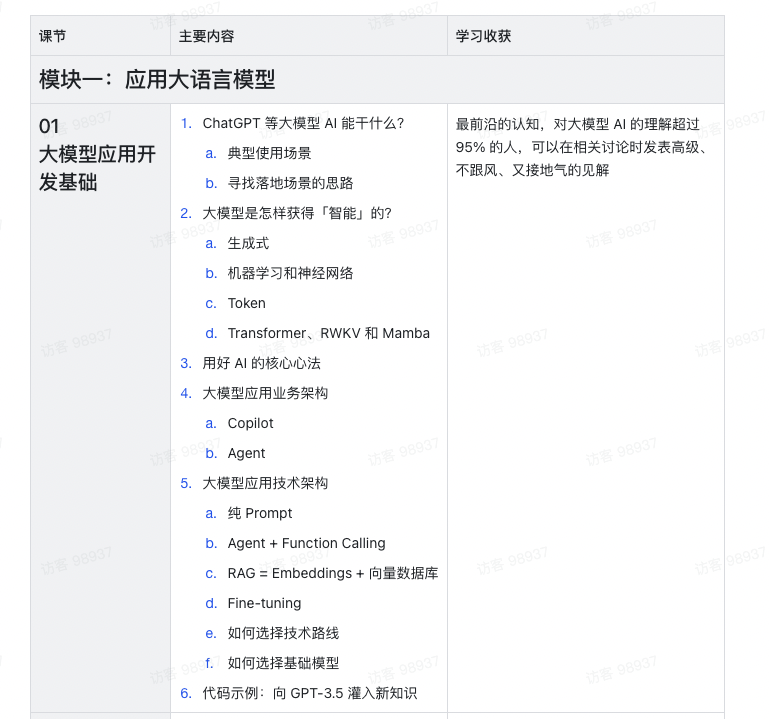
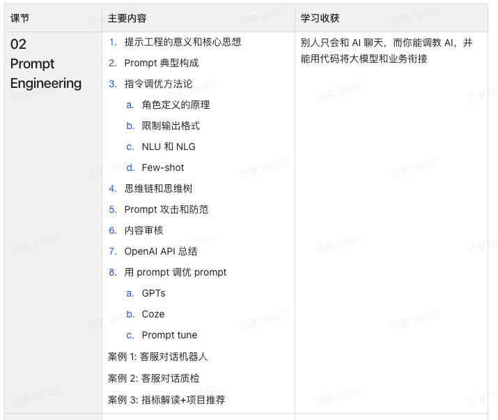
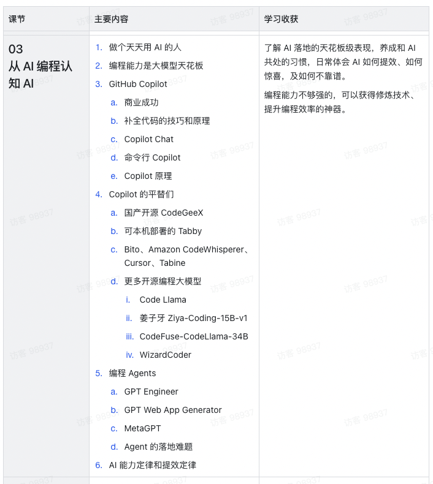
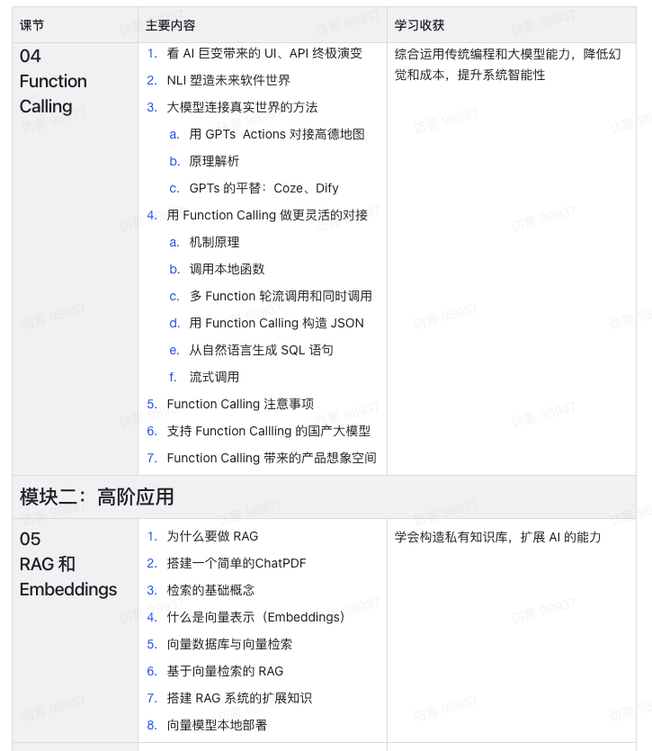
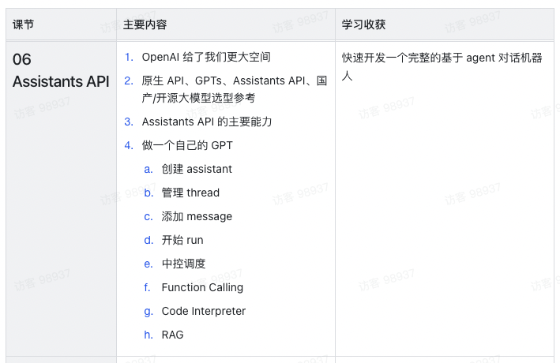
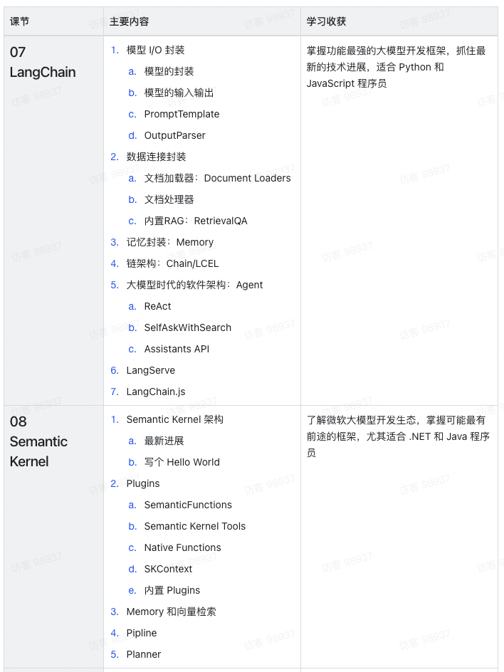
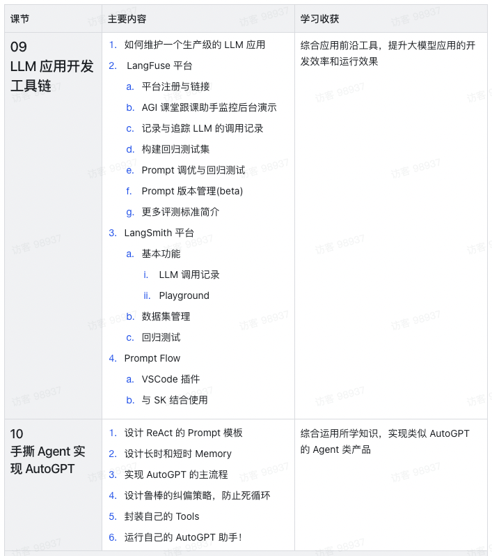
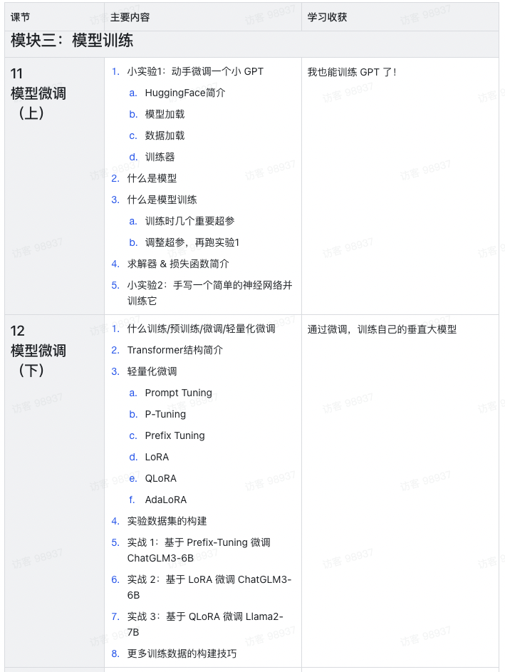
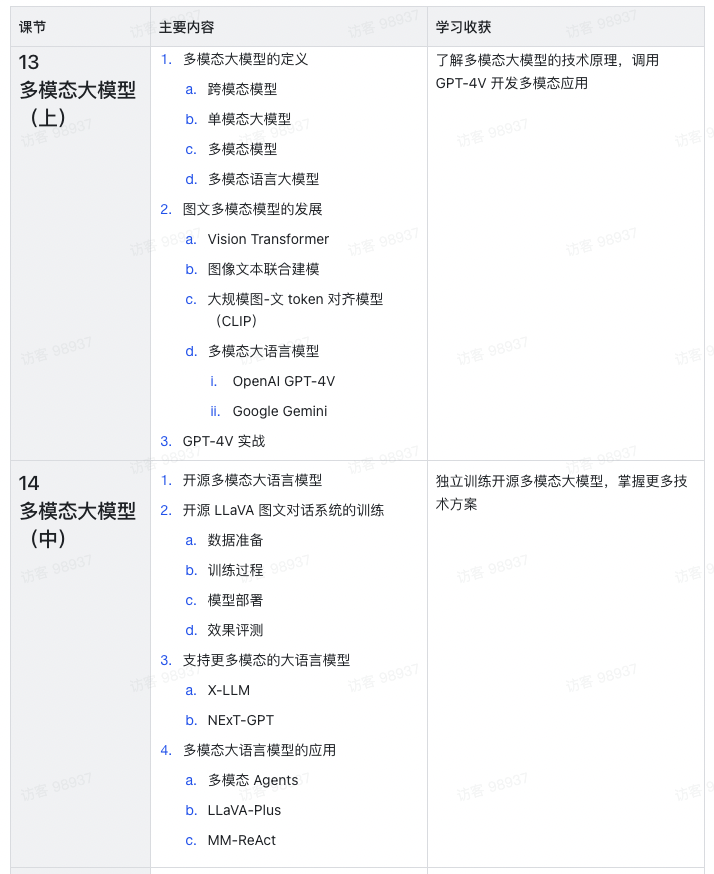
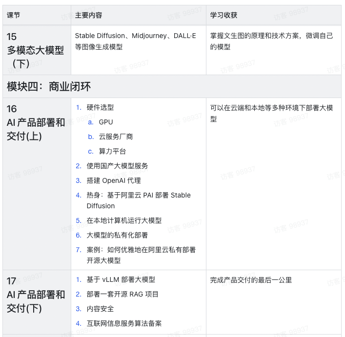
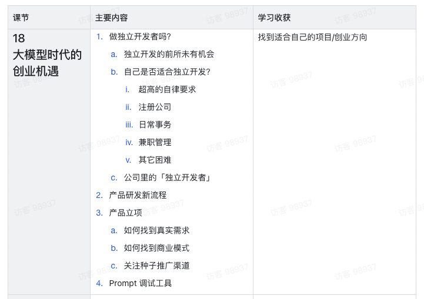
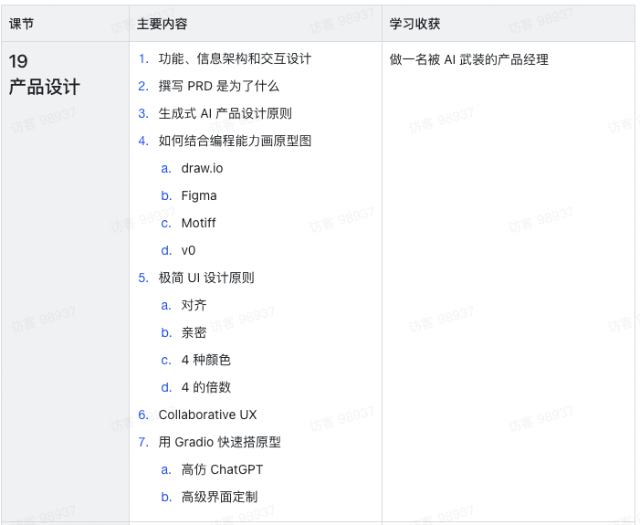
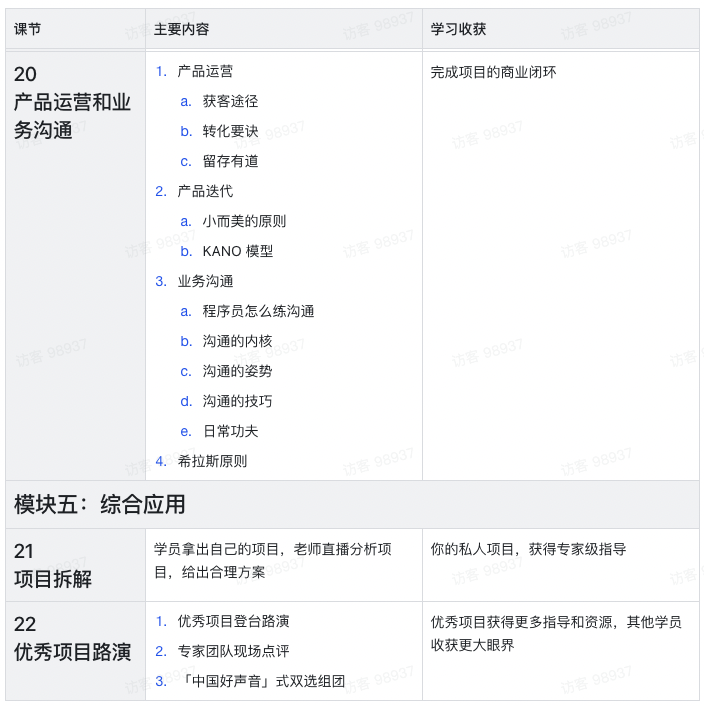

### [b站openbmb公开课](https://www.bilibili.com/video/BV1UG411p7zv/?p=2&spm_id_from=pageDriver&vd_source=2c2dd629dacf16f2809eea3e9618d04c)
### [【transformer零基础入门】不愧是顶级计算机大佬王树森主讲6h](https://www.bilibili.com/video/BV1Ni4y1W7my/?spm_id_from=333.1007.tianma.6-4-22.click&vd_source=2c2dd629dacf16f2809eea3e9618d04c)