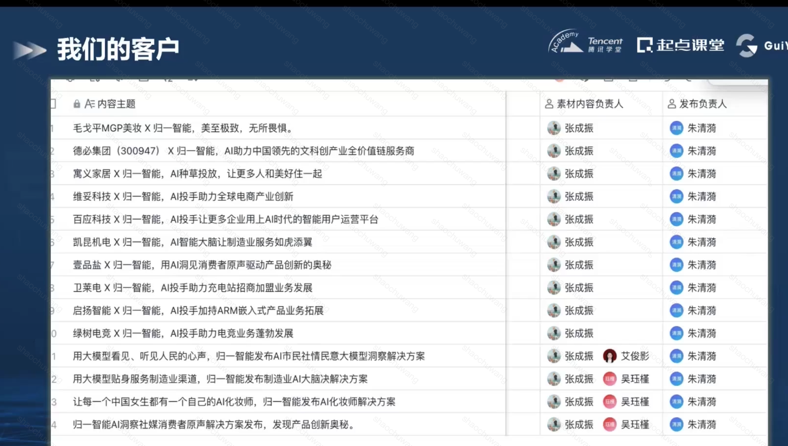

# 归一智能

## 定位：

## 案例1: 毛戈平
### 咨询陪跑流程：

- 需求探索 - ai员工定制-线上导购调研；
  将销冠能力转化固定为ai能力
 

### ai员工定制：
- 产品架构设计
- ai应用场景设计
  电商领域：AI知识库 + 情绪加持
  线下门店机器人

## 案例2: 凯昆机电
- AI工程师定制（凯昆大脑）
    
    场景：销售咨询依赖专业工程师专业知识介入；可通过ai能力实现高效回复经销商、代理商专业问题；

- 工控知识库【pdf+纸质数据转化】 + 专业对话

## 创业时间线
- 通过提供企业咨询获取企业实际的需求和ai落地可能性；
- 种子客户打磨需求：ai投手【搜索引擎投放】
    
- 广告投放场景关键痛点

## AI+产业MVP落地关键要素

## PMF的策略设定与校验

## 大模型数据安全和合规实践

## 商业模式
 