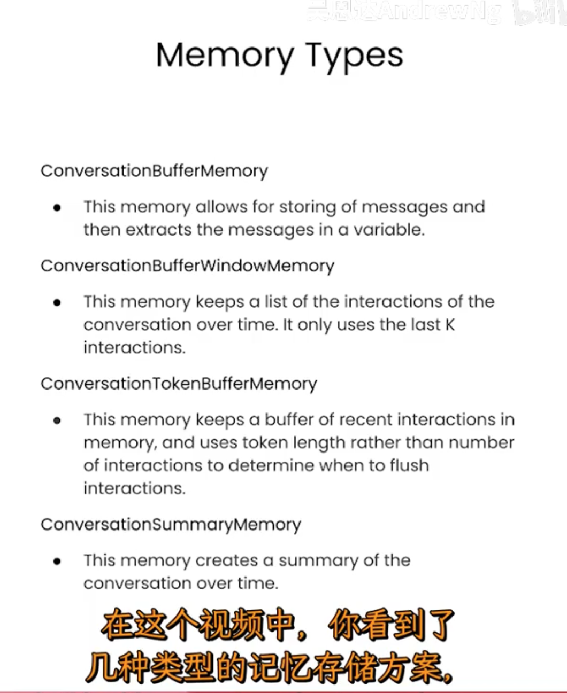
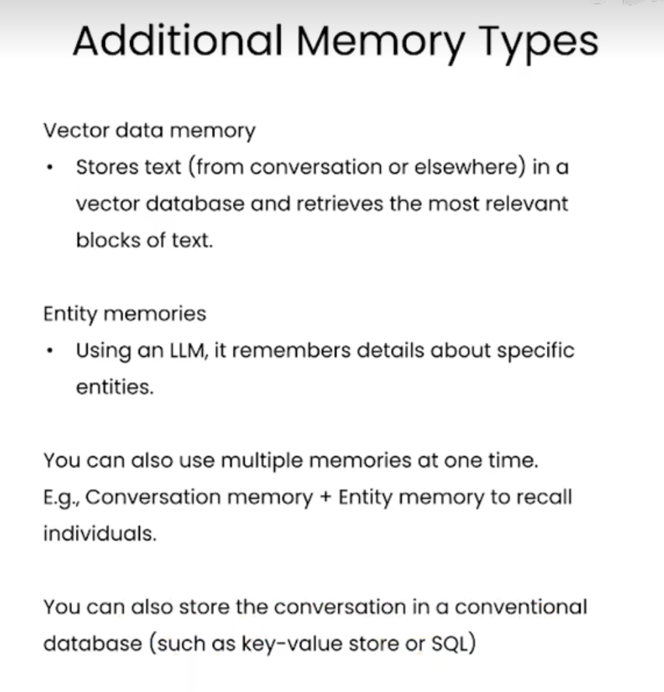

# andrew wu: langchain and rag

## langchain

[link](https://www.bilibili.com/video/BV1XC411n72m?p=9&spm_id_from=pageDriver&vd_source=2c2dd629dacf16f2809eea3e9618d04c)

### 3. memory
stateless;

need provide the full conversation as 'context'

confinient memory types:

-  ConversationBufferMemory
-  ConversationBuffeWindowMemory
    most recent conversations;
- ConversationTokenBufferMemory
    max_token_limit
- ConversationSummaryBufferMemory
    

- additional types

### 4. chains
- LLMChain
- SequentialChain
  1) simpleSequentialChain
  2) regular sequentialChain
- router chain
  1) multiPromptChain
  2) LLRouterChain
  3) RouterOutputParser

### 5. QA over document
1) 创建向量存储
- vectorstores
- vectorstoreIndexCreators

2) core understanding
- embeddings
- vector database

3) method type
- stuff method: 
    one query one response
- map_reduce:
- refine
- map_rerank

### 6. evaluate application

- debug
- QAEvalChain

### 7. agent
- reasoning engine
thought => action 

- custom tool

## RAG

### 1. intro

2 retrieval methods: 
sentence window retrieval / auto emerging retrieval
[lamma Index: jery niu];

3 evaluation methods: trustworthy ai;
  - contenxt relevance;
  - groundedness;
  - answer relevance;

production-ready rag-based LLM apps;

### 2. RAG

- sentence-vindow retrieval
  
- auto-emerging retrieval

### 3. rag triad evaluation

- context relevance
- response relevance
- answer relevance