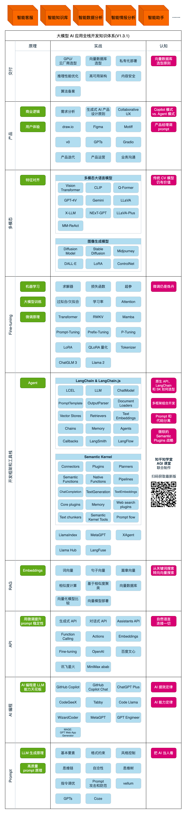
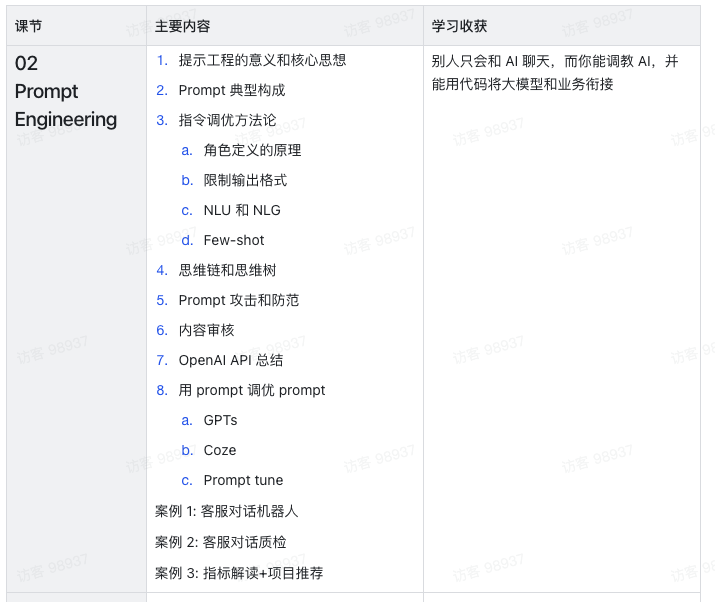
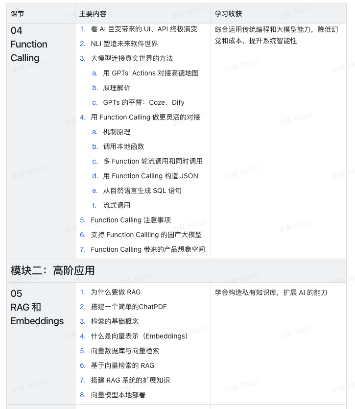
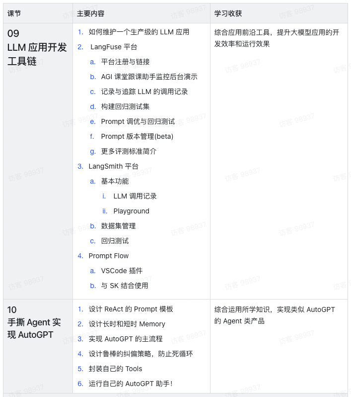
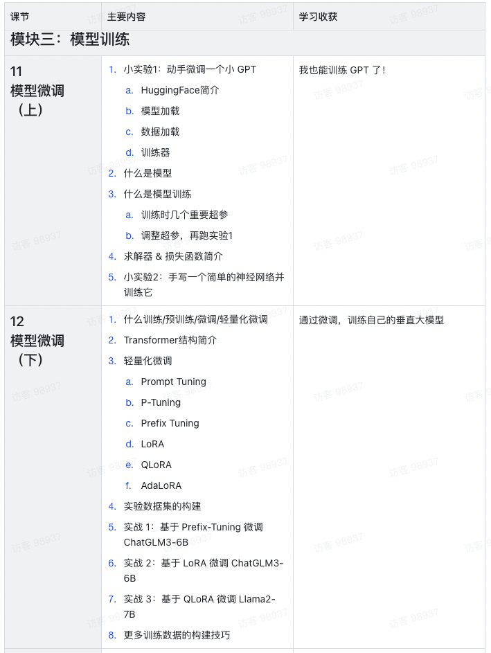

# 知识体系

##

## 他山之石

### 【知乎学堂agi课程】

- 课程大纲：
  https://agiclass.feishu.cn/docx/FULadzkWmovlfkxSgLPcE4oWnPf
  https://agiclass.feishu.cn/docx/KjFSdqxTZoDDfcxzikHcjjx0nDg
- 课程学员demo: https://agiclass.feishu.cn/docx/M5xydPVjWovB9exHBjDc7IMYnub
- 大纲截图：

