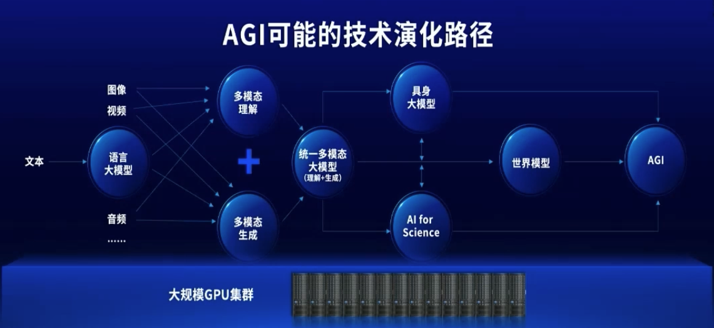
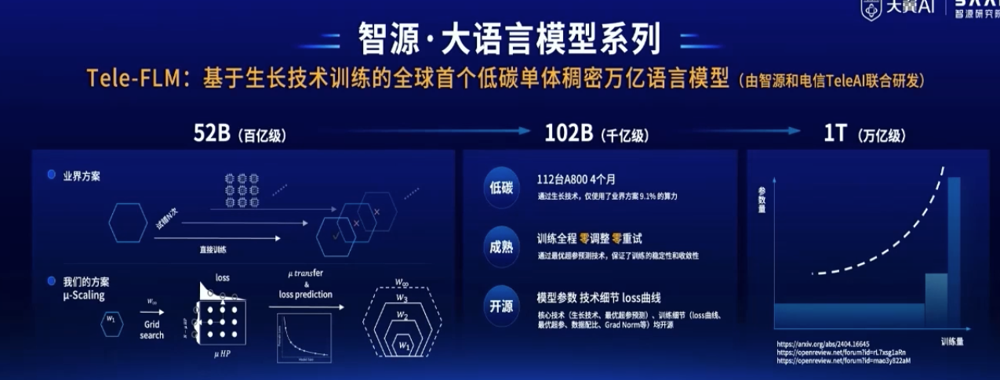
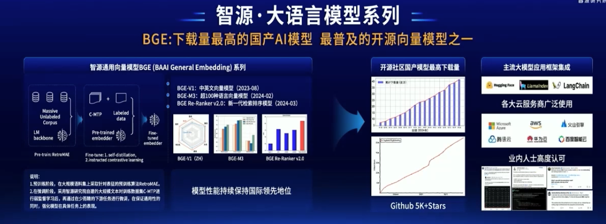
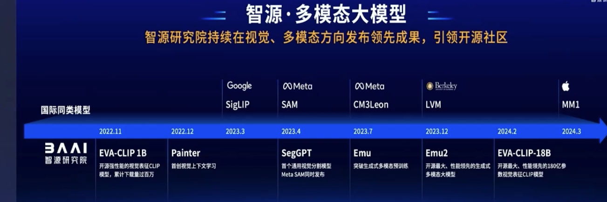
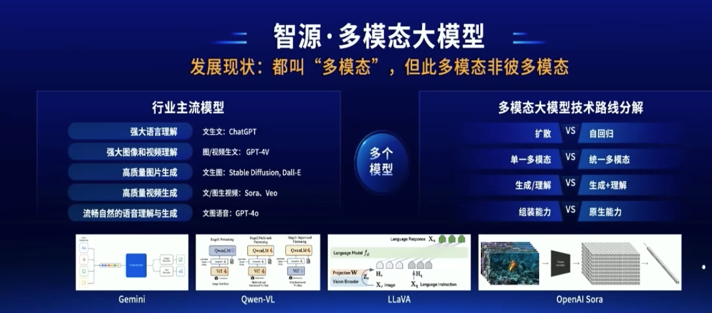
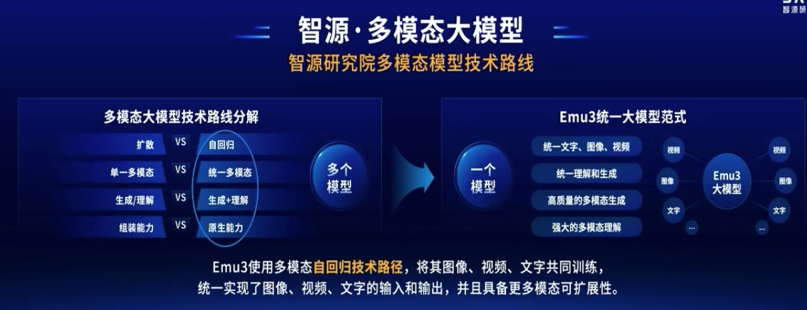
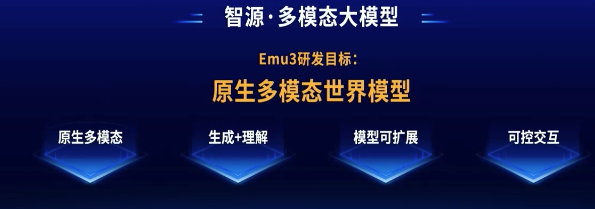
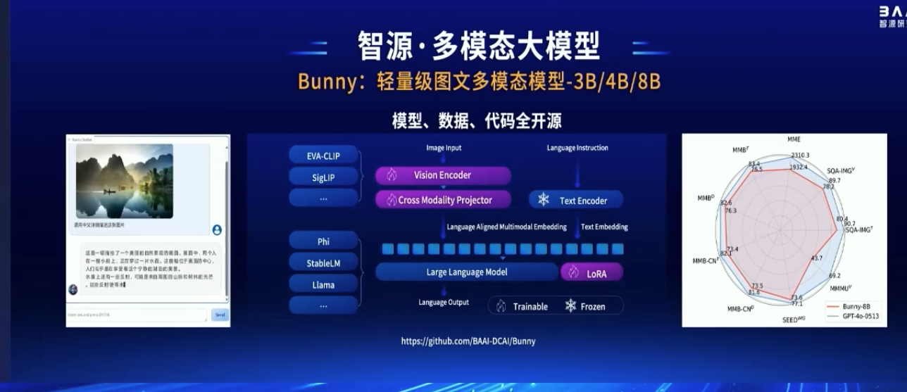
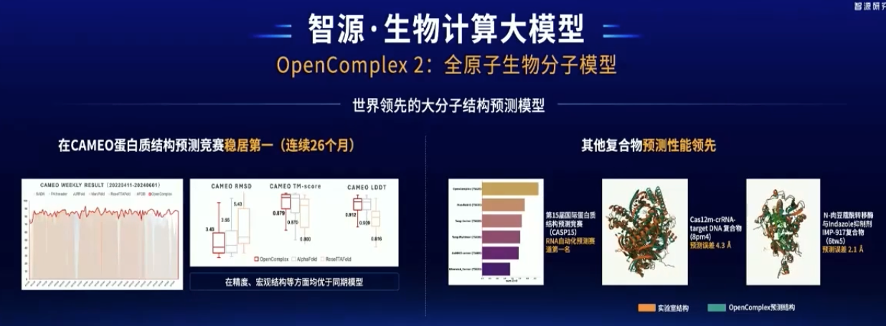
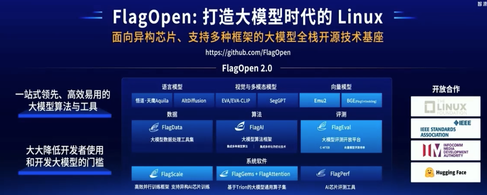

# 2024智源大会

## 01 黄铁军
介绍了智源研究院源头；

## 02 王仲远

- scaling law 并非新鲜的事物

从大模型参数 => 大脑的参数

- agi可能的技术演化路径

- 智源大模型全家桶

1、大语言模型

基于生长技术的dense万亿大模型，仅仅基于112台A800

BEG大模型：Langchain已经集成了？

2、多模态模型

- Emu3

- Bunny

3、具身大模型

- Cradle
- 
  
4、生物计算大模型

5、基座
