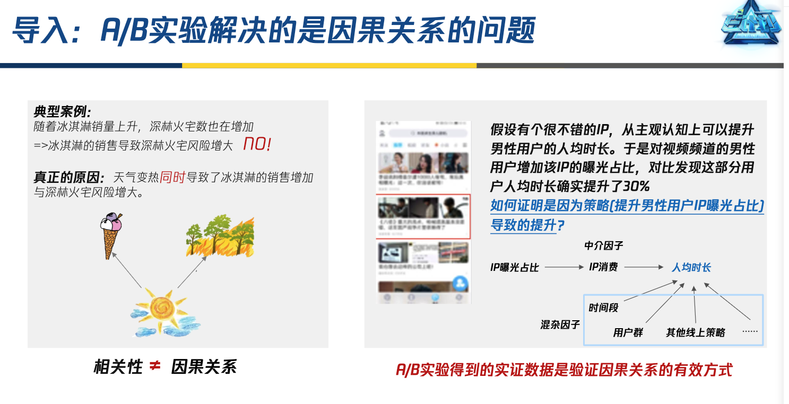

# 产品e计划: PCG策略产品经理场景化数据能力提升项目

[学习地址](https://portal.learn.woa.com/training/mooc/projectDetail?scheme_type=mooc&mooc_course_id=1442)

# 进阶课1: 策略产品数据分析方法课

## 策略产品的基本定位和职责
策略产品经理的定位：推动多角色团队全面刻画问题和拆解分析（项目经理pm、算法工程师、数据分析师）

策略产品：策略（基于数据分析和推演、刻画用户问题）+产品；

基本工作流：首先定义明确的问题，好与坏的评价标准；其次不断的拆解和归因，直到问题的最终解决；

## 定义目标比解决问题更重要

## 三大数据分析方法

### 一、描述性分析方法
- 业务链路分析方法：乘法
- 业务结构分析方法：加法
- 系统分析方法：组合多种分析方式

### 二、探索性分析方法

#### （一）聚类分析方法
1、适用场景：
- 搜索典型用户
- 广告商业化：用户特征分群、广告商分群
- 推荐算法：用户典型内容偏好

2、例子：
打车app司机聚类分析：应答率。

#### （二）回归分析方法
1、波士顿房价因素影响；
2、小世界用户活跃度影响

#### （三）机器学习分析方法

### 三、验证性分析方法【因果推断】
- 相关性 不等于 因果关系
- 因果推断的方法：
  1）ab实验 2）观测数据
- 优先采取ab实验的方法
  - 群体效应分析

### 小结

## 如何避免分析陷阱

### 1、保障数据源的质量

上报过程监控：方便监控上报数据异常情况

### 2、片面理解业务

### 3、统计显著性vs.业务显著性

### 4、分析的有效性：
#### 4.1 内部有效性：
- 错把相关当因果
- 辛普森悖论
  
- 选择性偏差
  
#### 4.2 外部有效性：
- 新奇效应：先正向后负向
- 周期效应

## 全课程小结

# 进阶课2: A/B实验进阶方法&避坑指南

## 1、职能定位

## 2、实验指标设计

## 3、实验全流程
### 实验前：
- 白名单测试
- 数据上报走查

### 实验中<避坑指南>:
- 上报问题：

- 需要关注的监控指标：

- SRM比例：

### 实验后：实验结果页
- 真正有效的p值应当是收敛的

- 实验指标从显著变成不显著了，什么原因
  
- 假阳性问题

## 基础概念：
- p值
- 弃真取伪
- 实验设计的科学性

# 进阶课3：画像中台系统认知与应用实操

## 子课1:用户定位与洞察、用户画像助力策略落地

### 画像基础及应用场景

### 画像中台认知与理解

# 进阶课4: sql语言基础

# 进阶课5：《推荐系统认知与理解》推荐系统认知及原理介绍

两个核心四大环节：

推荐策略优化：
