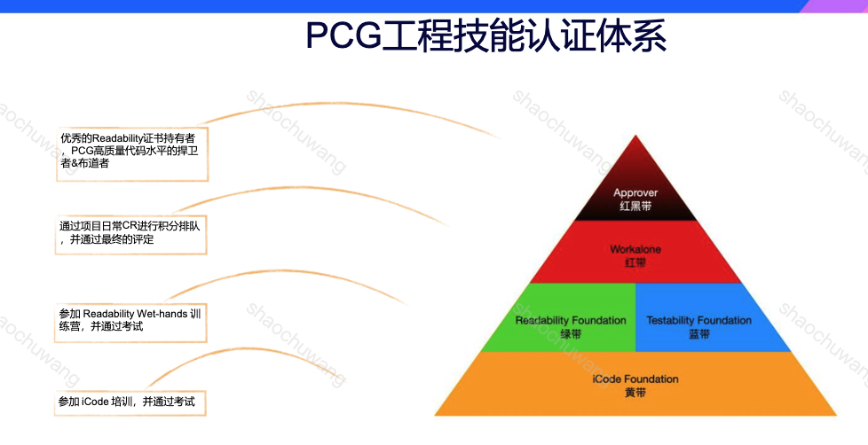

# code review学习记录

## 学习笔记：
readability整体课程：http://v8.learn.oa.com/user/net?act_id=19221

训练营真题内容：https://tesc.woa.com/escweb/personal-center/my-exercises

【精品资料】js-iread知识点总结：https://doc.weixin.qq.com/mind/m3_m_GBDusDgPbBuD?scode=AJEAIQdfAAoGF3uHPZAJkA_AaSACQ

### 知识点整理

一、修改建议的方法论：

- solid
- 代码的坏气味:
  - 神秘命名
  - 重复代码
  - 过长函数
  - 过长参数列表
  - 全局数据
  - 可变数据
  - 发散式变化：原有模块能力被修改后变得不再内聚
  - 霰弹式修改：一处修改处处修改；可以做内联式的改动
  - 依恋情结：最大化内部交互、最小化跨区域交互【和其他原则可能有冲突】
  - 数据泥团
  - 基本类型偏执
  - 重复的switch / 循环语句 / 冗余的元素 / 
  - 临时字段
  - 中间人 / 内幕交易
  - 过大的类
  - 纯数据类
  - 被拒绝的遗赠 / 注释变成除臭剂

二、设计问题：

- 架构设计：
  - 应该有合理的分层：架构设计。一般是指合理的架构分层，需要理清代码主要类的职责，及其调用方和依赖方的职责。
  - Solid原则：
    - 单一职责原则：
      - 对于一个类应当只有一个原因会引起他的变化；
      - 修改：拆分
    - 开放关闭原则：
      - 对扩展开放、对修改关闭
      - 修改：抽象/表格模块
    - 里氏替换：
      - 子类型必须能够替换掉他们的基类
      - 修改：通过契约（前置条件/后置条件）；or通过提取公共部分的方法代替继承
    - 依赖倒置原则：
      - 高层次模块不应该依赖于低层次模块；
      - 抽象不依赖于细节，细节应该依赖于抽象；【任何变量不应该持有指向具体类的指针或引用、任何类不应该继承自具体类、任何方法都不应该覆写任何基类中已经实现的方法】
    - 接口隔离原则：
      - 如果类的接口不是内聚的则说明是个胖接口

- 类设计：
   - 合理的职责划分：职责过多的类可拆分
   - 类的层次问题：对上层有依赖，耦合度太高
   - 功能封装是否合理：
   - 事件模型一致性
   - 函数副作用
   - this作为参数透传的问题

- 数据设计：
   - 数据类要明确自己的数据管理职责
   - 内部定义的具体数据结构要正交，若定义了底层数据管理类，则详细操作要下放，做好封装
   - 占位数据设计：占位数据的功能和真实数据是不一样的

三、实现问题：

- 代码逻辑：
  - 代码逻辑不能有缺陷/逻辑合理/可读
  - 魔法
- 命名：命名本身要合理可读
  - 文件名：kebab-case / 类名：PascalCase / 常量、变量、函数
  - private成员是否带下划线要保持一致
  - 拼写错误
  - 名字上不要带类型
- 一致性问题：
   - 提交信息和代码保持一致
   - 函数名和代码实现一致
   - 命名一致：同一概念不应多次重复命名
   - 异步写法保持一致：async/await，Promise 还有回调形式
   - 事件模型要有一致的使用方式：全局 eventBus，传参 callback 回调，类自身负责触发监听 notify/on。
   - import和require不要混用
- 复杂性：
  - 单一职责原则：
  - 避免不必要的复杂性：更少代码实现同样逻辑；??=
  - 封装细节。把复杂逻辑用语义化的子函数封装起来，让人一目了然；
  - 优先使用标准库中的能力：
    - 优先使用标准库中的能力# 可以直接用 `.sort((a, b) => a.toLowerCase().localeCompare(b.toLowerCase()))` 简化
  - 避免重复；
- 作用域：
  - 避免全局对象，尽量缩小变量作用域，封装到对应职责的类中
  - 避免传递 this。最小依赖原则
  - 避免传递this
- 惯用法：
  - 避免直接操作dom
  - 尽量使用简写：??=
  - 箭头函数绑定this
  - 模版字符串能用就用
  - 避免any和console.log
- 注释：
  - 决策权衡信息应通过文档注释明确
  - 不必要的注释不要保留
- 顺序问题：
  - import引用顺序、路径、export default少用；
  - 类的成员变量顺序问题
  - 函数顺序问题
- 规范问题：
  - 使用绝对路径或者alias；
  - 魔法字面量/魔法数字不能有
  - 合理的空行

### readability整体课程：
pcg工程认证体系：

- cr的最佳实践：
1. cr的要求：一次200 ~ 400 loc；
2. 单次提交评审量应当低于500loc/小时；
3. 一次评审不要超过60分钟；

- cr的主要内容
1. 规范层面：
   代码风格
   注释：fix / todo；生成代码api文档
2. 实现层面：
   一致性：写法
   复杂性
   命名：清晰表达逻辑的真实含义
   测试代码
3. 方案架构：
   整个架构是否合理、是否清晰、是否可扩展、是否容易阅读理解

- cr的过程
1. 提交注释、cl快速浏览
2. 设计层面和关键实现层面的评审【合理、简洁、可读、性能问题、bug】
3. 其他实现层面和规范层面【一致性、可读性】

- 考试评分流程【最新流程有所不同】
通过率非常低
1. 初评审
   kcp初评审（关键评论点key comment point）。不是很明显但是非常隐蔽的问题。用来筛选和卡kcp。
   注意：大部分是设计方面的问题。
   基本方法：
   1）总体上，识别和理解当前代码的业务实现目标
   2）识别实现该目标最关键的设计问题
2. 详评
   初审、复审
3. 根据通过率划线、发布参考答案

### round0
总体阅读：
- 纯函数【指责单一】vs. 副作用【职责过多】
- 命名多余 vs. 命名歧义不清晰 都不可取
- 异常逻辑应当提前返回
- try catch
=〉
识别kcp：大概率是一些代码设计问题
- 一个函数职责过多
- 明明可以缓存却占用了磁盘读写

### round1 
1. import相关
   - 顺序问题（公共引用 vs. 私有引用 vs. 自有目录引用）
   - 类的命名应当是pascal命名而非驼峰
   - 引用路径方式：../ vs. @/
   - 包命名：应当全部使用小写并采取_分割
   - utils垃圾堆
   - import vs. require
2. 命名问题
3. 注释和代码不一致
4. 函数问题：
   - 工具函数 vs. 类内函数
   - function语法 vs. 箭头函数
   - 函数和回掉函数的命名一致性
   - ret code不应当在业务层处理；
   - bind和箭头函数同时使用需要引起注意；
   - bind操作一定要特别注意；
5. 生命周期
   - 构造函数和生命周期之间不应该有其他逻辑；
   - componentWillMount
   - componentDidUpdate
6. 防腐层技术【是个啥东西？】
   - 一个场景：获取window.xxxx包
7. 魔数问题：提取成常量
8. 尽量使用“装饰器”来取代flag标志位：
   不要将无关的工作流加入到业务逻辑类的执行中
9. 污染全局对象问题
10. 模版字符串 取代 字符串拼接
11. console.log应当用一些日志上报工具取代
12. JSON.parse一定要加上try...catch
13. 拼写错误
14. 可以封装的应当封装成合理函数
15. 硬编码：汉字之类
16. 多余的代码逻辑
17. dom编程的注意：
    querySelectorAll谨慎使用

问题回顾：
1. 职责不清【一定是个kcp】
2. 指代精准、语序通顺

标准表达：
1. 命名规范的专业名称：
   - snake case: number_of_donuts
   - kebab case: number-of-donuts
   - camel case: numberOfDonuts
   - pascal case: NumberOfDonuts
  
2. 命名和注释不匹配。js 项目建议使用标准 jsdoc 对成员变量编写注释。
   
   [使用jsdoc提高代码的可读性](https://juejin.cn/post/6844903828123320334)

3. 关于bind：

   只是在对性能有极端要求的特殊场景，才可以写为 bind 形式，并写明使用 bind 的原因，和对性能的影响。除此以外，如果是确实需要 bind 的方法，建议使用 property initializer（会多占用一些内存），否则，使用原型方法定义。**查看上下文之后，refreshCurrentList 方法用 property initializer 即可**

4. 关于document api:
   
   - 自定义事件不要绑定在 document 上，通过事件 manager 处理。事件绑定后，组件销毁时必须销毁事件回调。事件绑定部分函数单独抽离成函数
   - 尽量不要依赖特定的 dom 结构来判断诸如组件是否展示的逻辑。
      如果别人的样式变了，这里就挂了。建议：StateManager，Context，Provider/Consumer
      1. StateManager.notificationContainerHidden
      2. 当需要共享 data 给整个组件树中的多个组件时，推荐使用[React context](https://reactjs.org/docs/context.html)。

      ```javascript
      const NotificationContainerStateContext = React.createContext({ notificationContainerHidden: false });
      祖先级:
      <NotificationContainerStateContext.Provider value={{ notificationContainerHidden: true }}><ComponentTree /></NotificationContainerStateContext.Provider>
      树中子级需要使用状态的组件: ChildComponentClass.contextType = NotificationContainerStateContext，然后 ChildComponentClass(extends from React.Component) 的生命周期内就可以通过 this.context.notificationContainerHidden 获取传入的值了。```


5. 关于global和window:

   - 建议使用 globalThis 代替 global 和 window
   - 不要在 window 上写入值。应该通过一个防腐层保证 padutils 的可用性，而不能使用这种防御性措施。
   [基于 Observable 构建前端防腐策略](https://www.xieyadong.com/blog/frontend-anticorruption-layer)

6. 关于装饰器：
   
   避免通过标志位来控制流程逻辑例如 once 这样的逻辑。可以通过 once decorator 来控制流程逻辑
   [装饰器实现单例模式](https://juejin.cn/s/%E8%A3%85%E9%A5%B0%E5%99%A8%E5%AE%9E%E7%8E%B0%E5%8D%95%E4%BE%8B%E6%A8%A1%E5%BC%8F)

7. 关于硬编码：
   
   建议：不要写死text，最好从Resources读取，未来针对国际化可扩展性好一些。
   
   需要考虑国际化的话，应该将文案配置化，例如“配置名: 对应语言的文案"的方案，而不是硬编码到代码中。

8. 关于可选链：
   这里建议简化 optional chaining 语法，为 if（newProps.applyList.list[TAB_CURRENT_DOCS]?.length）

9. 用 const 而不是 let

### round 2: 

1. 类成员顺序：
   - 先静态再实例
   - 先成员变量，构造函数，再方法
   - 先public\protective\private
   - return之前添加剂空行

2. 不允许带下划线作为变量名
3. 类的功能划分：

   一切直接操作类成员属性的逻辑都可提取成为父类的成员方法。

4. 重复代码要进行拆分【职责划分】
5. 【ts】类型定义的合理性: any / ts ignore
6. String()和toString()
7. filter vs. find
8. 不必要的promise： Promise中均是sync同步方法，则必须要promise包裹。

### round 3:

1. 函数的副作用：

- > fileExist 判断函数是否存在, 但没有使用函数的返回值. 推测应该是使用了函数的副作用, 文件不存在时创建文件, 如果是这样的话函数命名为 ensureFileExists 更合适.

- > 构造函数中不应该出现副作用, 移到 init 中执行.

1. 代码的抽象层次问题：

此处代码的抽象层次有问题, 变成由 Feflow 类外部去处理 Feflow 类内部应该处理的事情了.
上面与 cmd 相关的解析过程, 加上事件的触发, 都应该封装在 Feflow 的 init 函数中.

3. 系统内建模块的冲突：

> 项目中模块的名称建议不要跟系统内建模块重复, 使用时不易分辨.
这里可以使用 async-fs 作为模块名, 加上命名空间方式引入, 可以更好地区分是项目中的模块还是系统内建模块.
> ```javscript
> import * as asyncFs from '../shared/async-fs';
> asyncFs.mkdir(...);
> ```

4. 类型系统设计：

> args 直接来自 minimist, minimist 库返回的对象是不能定义有哪些字段的, 建议自己定义.
> ```
>  interface FeflowArgs extends minimist.ParsedArgs {
>    version?: string;
>    ...
>  }
> ```

## 强化训练：
- import 和 export 满足规范# 按系统内置模块、第三方公开模块、公司内第三方模块、仓库内工具/公共模块、仓库内逻辑模块的顺序分组
-  CookieProcessing 和 getTicketTimer的状态管理没有封装好，会在多个地方逻辑更新，这样会导致的状态管理成本剧增，建议考虑更多的设计方式包括不限于单例、与项目状态管理工具结合等方式进行优化
- 整个工具函数库职责过多, 违反单依职责原则, 包含了登录态状态、运行时错误&页面曝光时长上报、缓存刷新、页面路由历史记录、webview通用刚发、视频加载等功能，建议将大的模块单独提取封装到子模块
- 类里的大部分方法，缺少访问修饰符控制。
- 代码简写list = Object.entries(json).map(([key, value]) => ...) 
- 建议使用最新的 node:querystring 模块
- 用更少的代码实现同样逻辑# 可以用getter来替代更合适
- 错误信息有利于排查问题# 没有监听 stream 的error事件，那在发生异常的时候会导致这里的promise永远不会fulfilled
- typeof NaN 也是number，建议使用Number.isFinite()检测是否为数字，otimeout应该要判断为是否大于0的整数
- [Object 和 Map 的比较](https://developer.mozilla.org/zh-CN/docs/Web/JavaScript/Reference/Global_Objects/Map)
- [TypeScript中implements与extends的区别](https://juejin.cn/post/6914213447169376263)
- CR也有自己的范例模版：问题+原因+建议的修改策略

  > 两处 writeFileAsync 的参数是一模一样的. 从代码逻辑上看, try-catch 只是为了捕获读文件的异常, 读不到或者读的有问题, 都会执行写入文件的操作, 如果写入操作报错是不处理直接退出的. 所以可以把 writeFileAsync 移出 try-catch:
   ```
   let pkgInfo;
   try {
      pkgInfo = await readFileAsync(rootPkg);
   } catch {
      // pass
   }
   if (!pkgInfo) {
      await writeFileAsync(...);
   }
   ```

## 一点思考：
名义是cr，实际上看的是底蕴和专业度。

针对性应试：
1）js代码所有知识点要过一遍；
2）补充代码设计层面的阅读；

## 学习资料：
[更全的学习资料入口](https://iwiki.woa.com/pages/viewpage.action?pageId=840242312)

[JS Readability 总结](https://doc.weixin.qq.com/mind/m3_m_GBDusDgPbBuD?scode=AJEAIQdfAAoGF3uHPZAJkA_AaSACQ)

[某前辈整理的考前准备](https://doc.weixin.qq.com/doc/w3_AJcAZwZ8AAo8LJViCCSQpSrJPqNjn?scode=AJEAIQdfAAoT3p5kGnAJcAZwZ8AAo)

[推荐书单](https://iwiki.woa.com/pages/viewpage.action?pageId=916552289)

## 通知&资料：

各位小伙伴上午好，恭喜大家通过业务部门/代码委员会理事/BG"传帮带"项目推荐获得【7月 iRead认证考试】名额。认证考试安排如下：
💙时间：7月26日下午14:30-17:00
💙地点：北京总部大厦209教室
💙题型：1~2道 代码评审题
💙环境：自备电脑
💙通过标准：能发现绝大多数代码问题，并提供正确的修改建议；从设计、实现两个维度进行考核，均有一个最低分作为通过认证的限制
💙注意：认证考试需线下集中进行，考场外作答成绩作废！
🌟请珍惜考试资源，如确因不可控因素需请假，须在7月24日12:00 前经推荐人审批同意（请假邮件主送推荐人、抄送v_yargao）并尽量替补其他同事，超时请假视为占用1次考试机会。

[玫瑰]为避免打扰他人，有其他问题请私聊班主任:v_yargao(高雅)

@所有人 【考前准备】🌟
1、完成iRead训练营培训：（7月23日24:00前完成，否则将无法正式参考❗）
（1）详细学习提示、认证流程机制变化要点详见链接：https://km.woa.com/group/readability/articles/show/506177
（2）线上学习系统地址：https://tesc.woa.com/escweb/personal-center/my-exercises
（3）完成训练营培训标准：
① 通过线上学习系统完成实操练习（对应三题的Comments至少达到10、15、20才视为完成）
② 通过线上学习系统完成视频学习
若完成，线上学习系统“我的训练-考试报名资格”栏将显示为“有报名资格”。

2、iRead考试已采用新的CR插件，大家可以提前在训练营和真题训练中进行体验。
（1）体验链接：http://tesc.site.woa.com/escweb/personal-center/my-exercises
（2）操作指引链接：
https://doc.weixin.qq.com/doc/w3_AEEA7QbYACcsme1knm1Q5eplam3yA?scode=AJEAIQdfAAoGNyNmJYAGUAvQbQACk
（3）实操演示录屏：https://meeting.tencent.com/v2/cloud-record/share?id=87645f5e-246e-4357-88b3-c9e617b343f8&from=3 （访问密码：QsF6）


