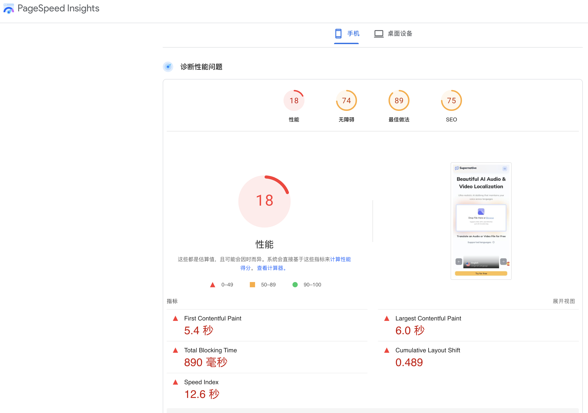
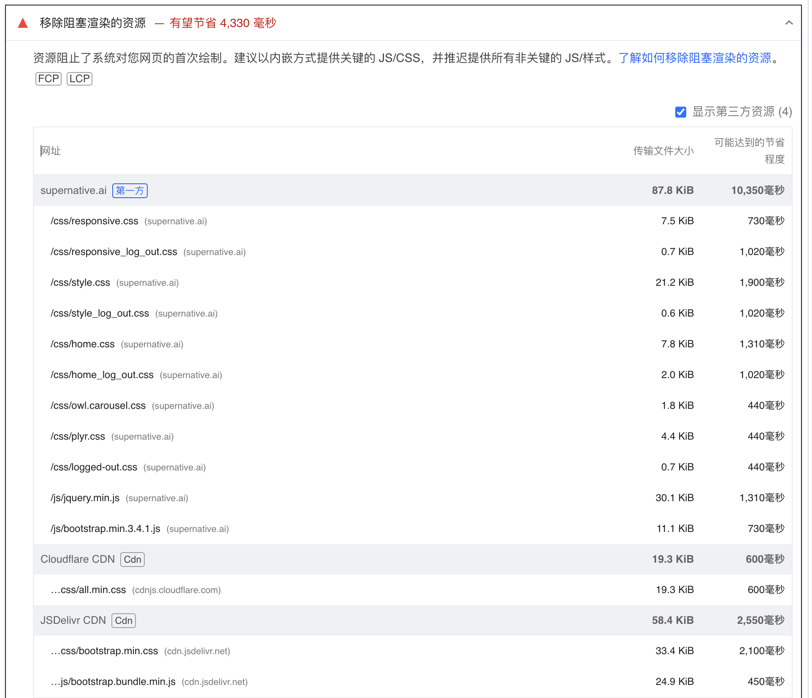
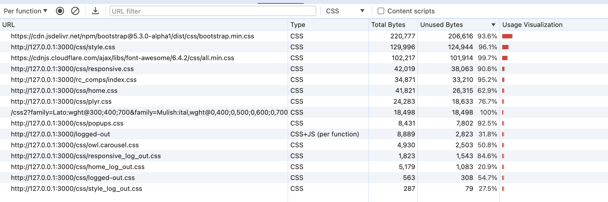
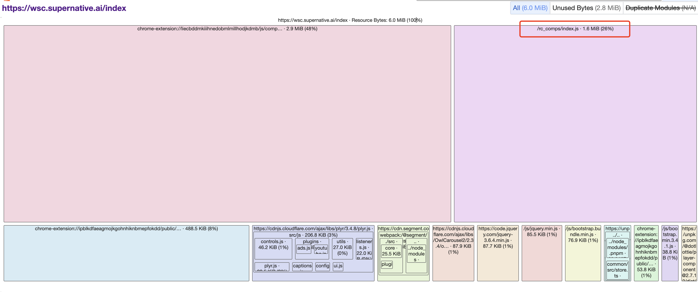
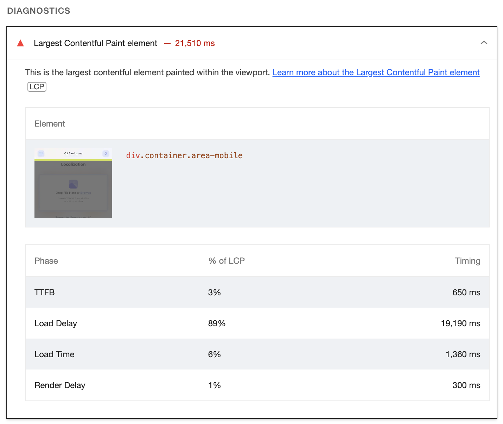
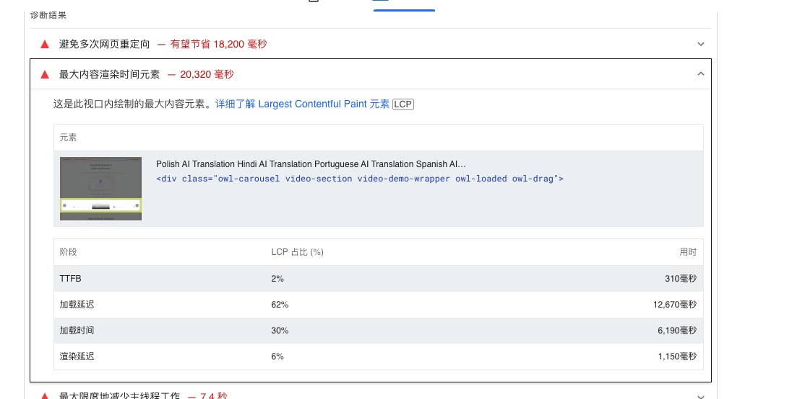
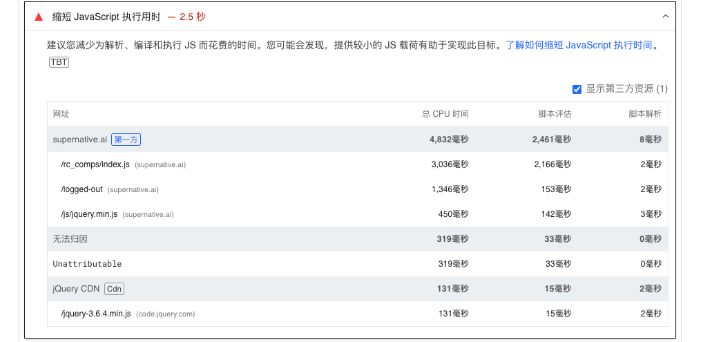
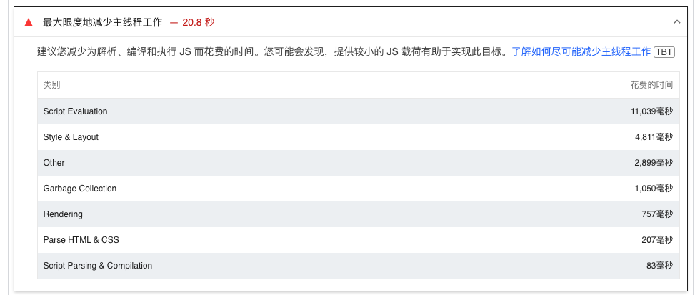

## 原始状态


- First Contentful Paint

FCP 衡量的是用户转到您的网页后，浏览器渲染第一段 DOM 内容所用的时间。 您网页上的图片、非白色 ```<canvas>``` 元素及 SVG 都被视为 DOM 内容；iframe 中的任何内容均不会包含在其中。

优化前：5.4s


## 优化方法：

###  1. [消除阻塞渲染的资源](https://developer.chrome.com/docs/lighthouse/performance/render-blocking-resources?utm_source=lighthouse&utm_medium=lr&hl=zh-cn)

  

1.1 如何识别关键资源？
  
使用 Chrome 开发者工具中的“Coverage”标签页来识别非关键 CSS 和 JS。
[如何打开coverage标签页？](https://developer.chrome.com/docs/devtools/coverage?hl=zh-cn)

1.2. 如何减少阻塞？

* 1.2.1. js文件减少阻塞：

  - 拆分https://supernative.ai/rc_comps
/index.js

  - script脚本增加defer【可行】（以index为例）

> Lighthouse 会标记两种类型的阻塞渲染网址：脚本和样式表。
> 1） 具有如下功能的 ```<script>``` 标记:在文档的 ```<head>``` 中 没有 defer 属性。 没有 async 属性。
> 2）具有如下功能的 ```<link rel="stylesheet">``` 标记：没有 disabled 属性。如果具有此属性，浏览器不会下载样式表。没有具体与用户设备匹配的 media 属性。media="all" 被视为阻塞渲染。

* 1.2.2. css样式文件减少阻塞

基本思路：

1）识别关键样式文件（不得不阻塞页面渲染的资源），后置非关键样式文件。(可以根据coverage工具进行识别)


2）利用link标签自带属性。[mdn link](https://developer.mozilla.org/zh-CN/docs/Web/HTML/Attributes/rel)


### 2. Enable text compression压缩文本资源
spa打包形成的dist: index.js大小过大；

> 方法：(!) Some chunks are larger than 500 kB after minification. Consider:
> - Using dynamic import() to code-split the application
> - Use build.rollupOptions.output.manualChunks to improve chunking: 
> https://rollupjs.org/configuration-options/#output-manualchunks
> - Adjust chunk size limit for this warning via build.chunkSizeWarningLimit.

- 基本思路：
  - [vite打包优化【用处不大】](https://developer.aliyun.com/article/1441756)
  - 项目整体改造成多入口多出口。（每个组件单独打包，减小打包体积；引用时按需引用不同的包）【todo】
  - 静态资源cdn化，服务层面实现压缩传输。

### 3. [Avoid large layout shifts](https://web.dev/articles/optimize-cls?utm_source=lighthouse&utm_medium=devtools&hl=zh-cn)

- 优化异步加载drop box导致的cls。

### 4.[提升LCP（Largest Contentful Paint element）]()



- 顶部栏加载时机优化【没有看到很好的办法】

### 5. [图片格式优化Serve images in next-gen formats](https://developer.chrome.com/docs/lighthouse/performance/uses-webp-images?utm_source=lighthouse&utm_medium=devtools&hl=zh-cn)


### 6. [缩短js执行用时](https://developer.chrome.com/docs/lighthouse/performance/bootup-time?utm_source=lighthouse&utm_medium=lr&hl=zh-cn)


代码拆分 => react多入口打包；

### 7. [最大限度地减少主线程工作](https://developer.chrome.com/docs/lighthouse/performance/mainthread-work-breakdown?utm_source=lighthouse&utm_medium=lr&hl=zh-cn)



https://aerotwist.com/blog/the-anatomy-of-a-frame/

## 其他

使用 Lighthouse 报告的优化建议
